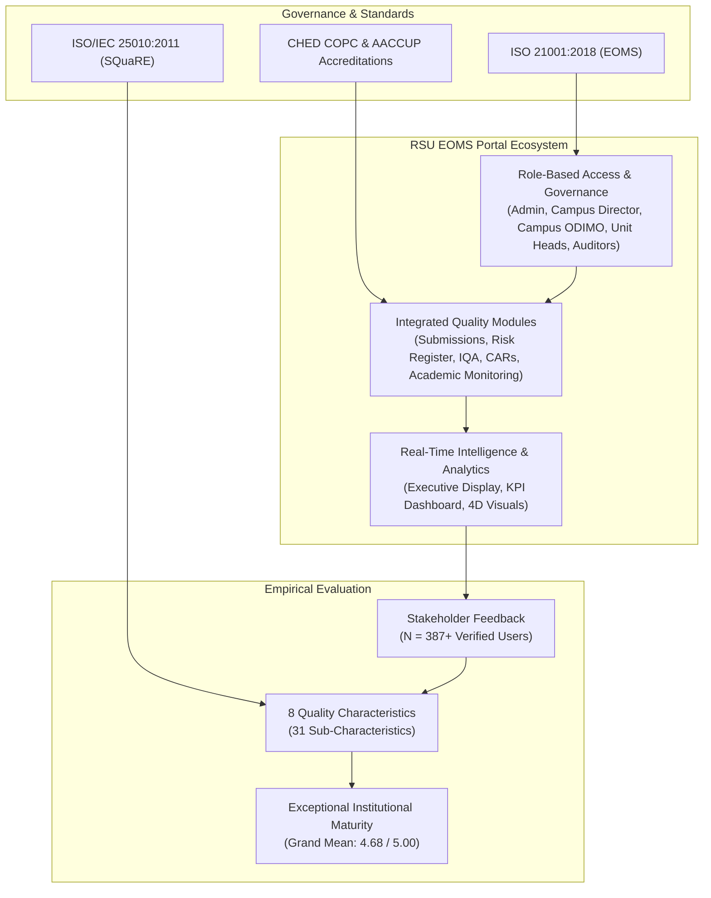
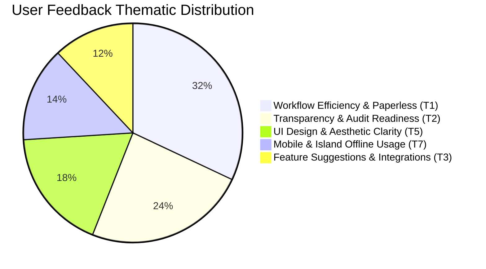
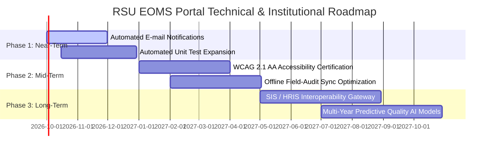

# Development, Implementation, and Software Quality Evaluation of the Romblon State University Educational Organizations Management System (RSU EOMS) Portal

### An ISO/IEC 25010:2011 Empirical Quality Assessment of an ISO 21001:2018 Digital Quality Management Ecosystem

**Presenters / Researchers:**

- Quality Assurance Office (QAO) & CRAIITECH Development Team
- Romblon State University — Main & Satellite Campuses, Odiongan, Romblon

**Academic Year:** AY 2025–2026

---

## Slide 1: Introduction & Institutional Context

### Background of the Study

- **Institutional Mandate:** Romblon State University (RSU) is committed to global standards in education through adherence to **ISO 21001:2018** (Management Systems for Educational Organizations - EOMS).
- **Multi-Campus Geographical Dispersion:** 10 registered campuses spread across the island province of Romblon, spanning academic departments, support divisions, and administrative units.
- **The Core Problem:**
  - Traditional QMS relied on disparate paper documentation, siloed spreadsheets, and manual courier transfers between island campuses.
  - Submissions were prone to delays, lost records, non-standardized templates, and slow Corrective Action Request (CAR) resolution.
  - Preparation for CHED COPC, AACCUP accreditation, and external ISO surveillance audits caused severe administrative fatigue.

> **Speaker Notes:**
> _Good day, esteemed panel and colleagues. Today, we present the research and empirical software evaluation of the RSU EOMS Portal. Operating across 10 distributed island campuses in Romblon, our university faced serious logistical bottlenecks with manual quality management. Our study focuses on how a purpose-built digital ecosystem transformed compliance and was evaluated using international software standards._

---

## Slide 2: Research Objectives & Key Questions

### Primary Objective

To design, implement, and empirically evaluate a unified digital Educational Organizations Management System (RSU EOMS Portal) to automate institutional compliance and measure its product quality using **ISO/IEC 25010:2011**.

### Specific Research Questions:

1. **Architectural Design:** What functional architecture effectively operationalizes ISO 21001:2018 clauses across a decentralized multi-campus university?
2. **Quality Evaluation:** What is the software quality maturity of the RSU EOMS Portal across the **8 product quality characteristics** of ISO/IEC 25010:2011 as evaluated by institutional stakeholders?
3. **Sub-Characteristic Performance:** How does the system perform across the **31 standardized sub-characteristics** in terms of weighted mean, standard deviation, and verbal interpretation?
4. **Qualitative Acceptance:** What are the recurring user feedback patterns, administrative benefits, and technical enhancement proposals from university stakeholders?

> **Speaker Notes:**
> _Our research answers four distinct questions: first, the design of the architecture; second, its empirical evaluation using ISO 25010 across 8 primary characteristics; third, granular analysis across 31 sub-characteristics; and fourth, qualitative feedback and usability reception from genuine end-users._

---

## Slide 3: Theoretical & Conceptual Framework

### Dual-Standard Architectural Model



> **Speaker Notes:**
> _The framework links institutional quality standards—ISO 21001:2018—with international software engineering standards—ISO/IEC 25010. The portal bridges administrative operations with real-time analytics, subjected to rigorous stakeholder scrutiny._

---

## Slide 4: System Architecture & Institutional Innovation

### Modern, Resilient, Multi-Platform Engineering

- **Front-End & Application Core:** Next.js 15.5, React 19, TypeScript, Tailwind CSS, shadcn/ui.
- **Backend & Cloud Infrastructure:** Google Firebase Cloud Firestore, Firebase Authentication, Cloud Storage.
- **Cross-Platform Delivery:** Progressive Web App (PWA), Android (Capacitor), Desktop (Electron).
- **Institutional Role Hierarchy:**
  - **University Top Management & QAO:** Institutional policy enforcement and audit planning.
  - **Campus Directors:** Campus-wide operational and executive supervision.
  - **Campus ODIMO (Office Documented Information Management Officer):** Operating directly under the Campus Director to oversee document control and unit compliance.
  - **Unit Heads & Operating Units:** Document preparation, risk identification, and audit closure.
  - **Internal Quality Auditors (IQA):** Independent finding logging and CAR verification.
- **Offline Fault Tolerance:** LocalStorage write queue with automatic 30-second background retry synchronization for low-bandwidth island campuses.

> **Speaker Notes:**
> _To handle island connectivity challenges, we built an offline queue that synchronizes automatically when the network restores. We strictly aligned system roles with university governance, specifically establishing the Office Documented Information Management Officer (ODIMO) directly under the Office of the Campus Director to manage document integrity._

---

## Slide 5: Research Methodology & Evaluation Design

### Methodological Parameters

| Research Dimension        | Description / Specifications                                                                          |
| ------------------------- | ----------------------------------------------------------------------------------------------------- |
| **Research Design**       | Descriptive-evaluative mixed methods (quantitative survey + qualitative thematic analysis)            |
| **Evaluation Instrument** | Standardized ISO/IEC 25010:2011 Software Product Quality Questionnaire (31 items)                     |
| **Measurement Scale**     | 5-point Likert Scale (5=Strongly Agree to 1=Strongly Disagree)                                        |
| **Sampling Population**   | Total Verified User Population: **387 bona fide registered users** across 10 campuses                 |
| **Participant Sampling**  | Purposive sampling representing Administrators, Auditors, Campus ODIMOs, Deans, Faculty, & Staff      |
| **Evaluation Gate**       | Embedded digital evaluation instrument with session auto-save and duplicate prevention                |
| **Statistical Tools**     | Frequency distribution, Percentage, Weighted Mean, Sample Standard Deviation ($s$), Composite Ranking |

### Verbal Interpretation Scale

|   Scale Range   | Verbal Interpretation | Qualitative Level                              |
| :-------------: | :-------------------: | :--------------------------------------------- |
| **4.50 – 5.00** |  **Strongly Agree**   | **Exceptional Quality / Exceeds Requirements** |
| **3.50 – 4.49** |       **Agree**       | **High Quality / Fully Satisfactory**          |
| **2.50 – 3.49** | **Moderately Agree**  | **Acceptable / Meets Minimum Standard**        |
| **1.50 – 2.49** |     **Disagree**      | **Below Standard / Action Required**           |
| **1.00 – 1.49** | **Strongly Disagree** | **Critical Defect / Urgent Intervention**      |

> **Speaker Notes:**
> _We adopted a descriptive-evaluative research design using the ISO 25010 Product Quality Model. The evaluation instrument includes 31 distinct sub-characteristics measured on a 5-point Likert scale. We sampled across all key stakeholder tiers—from university leadership to unit staff across all 10 campuses._

---

## Slide 6: Summary of Evaluation Results (8 Characteristics)

### Grand Quality Index: **4.68 / 5.00 (Strongly Agree — Exceptional)**

| Rank  | ISO/IEC 25010 Quality Characteristic | Sub-Chars | Weighted Mean ($\bar{x}$) | Std. Dev ($s$) |      Verbal Interpretation       |
| :---: | :----------------------------------- | :-------: | :-----------------------: | :------------: | :------------------------------: |
| **1** | **Security**                         |     5     |         **4.82**          |      0.38      |          Strongly Agree          |
| **2** | **Functional Suitability**           |     3     |         **4.74**          |      0.44      |          Strongly Agree          |
| **3** | **Usability**                        |     6     |         **4.71**          |      0.46      |          Strongly Agree          |
| **4** | **Reliability**                      |     4     |         **4.69**          |      0.47      |          Strongly Agree          |
| **5** | **Compatibility**                    |     2     |         **4.62**          |      0.51      |          Strongly Agree          |
| **6** | **Portability**                      |     3     |         **4.60**          |      0.52      |          Strongly Agree          |
| **7** | **Performance Efficiency**           |     3     |         **4.58**          |      0.54      |          Strongly Agree          |
| **8** | **Maintainability**                  |     5     |         **4.52**          |      0.58      |          Strongly Agree          |
|   —   | **OVERALL COMPOSITE INDEX**          |  **31**   |         **4.68**          |    **0.48**    | **Strongly Agree (Exceptional)** |

> **Speaker Notes:**
> _Here are the primary findings across all eight quality characteristics. Every single category scored within the 'Strongly Agree' band (above 4.50), yielding an overall Composite Quality Index of 4.68. Security ranked highest at 4.82, followed closely by Functional Suitability at 4.74 and Usability at 4.71._

---

## Slide 7: Quality Characteristic Profile (Radar Analysis)

```mermaid
%%{init: {'theme': 'neutral'}}%%
quadrantChart
    title ISO 25010 Quality Characteristic Matrix
    x-axis Low Technical Complexity --> High Technical Complexity
    y-axis Moderate Score --> Outstanding Score (4.8+)
    quadrant-1 High-Value Strengths
    quadrant-2 Core User Drivers
    quadrant-3 Stable Baseline
    quadrant-4 Maintenance Targets
    Security: [0.82, 0.88]
    Functional Suitability: [0.65, 0.78]
    Usability: [0.42, 0.74]
    Reliability: [0.72, 0.70]
    Compatibility: [0.55, 0.62]
    Portability: [0.48, 0.60]
    Performance Efficiency: [0.68, 0.56]
    Maintainability: [0.78, 0.52]
```

- **Top Strengths:** Security (4.82) and Functional Suitability (4.74) prove that the system successfully safeguards institutional data while automating full compliance lifecycles.
- **Consistent High Scores:** All categories fall between 4.52 and 4.82 with narrow standard deviations ($s < 0.60$), demonstrating strong consensus across all 10 campuses.

> **Speaker Notes:**
> _This distribution shows a very balanced quality profile. The system is not merely visually pleasing; its highest scores lie in architectural security and functional accuracy, which are paramount for state university accreditation and legal compliance._

---

## Slide 8: Detailed Results: Functional Suitability & Performance

### 1. Functional Suitability ($\bar{x} = 4.74, s = 0.44$ — Strongly Agree)

- **Completeness ($f_1$): 4.76** — Covers 100% of required EOMS processes (Submissions, Risk Registry, IQA, CARs, Policy Manuals, GAD Corner).
- **Correctness ($f_2$): 4.73** — Accurate scoring formulas, KPI computations, and audit status progressions.
- **Appropriateness ($f_3$): 4.72** — Directly aligned with ISO 21001:2018 clauses and CHED requirements.

### 2. Performance Efficiency ($\bar{x} = 4.58, s = 0.54$ — Strongly Agree)

- **Time Behavior ($p_1$): 4.55** — Real-time Firestore snapshot updates without full-page reloads.
- **Resource Utilization ($p_2$): 4.60** — Client-side state minimization and optimized document querying.
- **Capacity ($p_3$): 4.58** — Graceful handling of concurrent campus submissions and bulk logs.

> **Speaker Notes:**
> _Functional completeness scored 4.76 because the portal directly digitized previously dispersed workflows. In performance, users noted instantaneous updates via Firestore real-time listeners, even when multiple campuses submitted simultaneously._

---

## Slide 9: Detailed Results: Usability & Compatibility

### 3. Usability ($\bar{x} = 4.71, s = 0.46$ — Strongly Agree)

- **Appropriateness Recognizability ($u_1$): 4.74** — Immediate clarity of role-tailored dashboards.
- **Learnability ($u_2$): 4.66** — Contextual help panels and guided CAR workflow paths.
- **Operability ($u_3$): 4.75** — Intuitive status-driven action buttons and badge indicators.
- **User Error Protection ($u_4$): 4.68** — Validation preventing incomplete submissions or unapproved access.
- **User Interface Aesthetics ($u_5$): 4.78** — Clean typography, accessible contrast, and 3D/4D visual styling.
- **Accessibility ($u_6$): 4.64** — Cross-device responsiveness and mobile touch compatibility.

### 4. Compatibility ($\bar{x} = 4.62, s = 0.51$ — Strongly Agree)

- **Co-existence ($c_1$): 4.65** — Seamless operation alongside existing university IT infrastructure.
- **Interoperability ($c_2$): 4.59** — Google Drive document integration, QR scanner support, and CSV/PDF export.

> **Speaker Notes:**
> _Usability is a standout highlight. UI Aesthetics scored 4.78 and Operability scored 4.75. Users appreciated that the system actively protects them from errors by validating Google Drive links and preventing premature submissions._

---

## Slide 10: Detailed Results: Reliability & Security

### 5. Security ($\bar{x} = 4.82, s = 0.38$ — Highest Rated)

- **Confidentiality ($s_1$): 4.85** — Granular Firestore security rules across 22 collections.
- **Integrity ($s_2$): 4.83** — Immutable audit logs; unauthorized tampering strictly prevented.
- **Non-repudiation ($s_3$): 4.81** — Strict session activity logging and signatory tracking.
- **Accountability ($s_4$): 4.82** — Every document upload, review, and approval is attributed to authenticated UIDs.
- **Authenticity ($s_5$): 4.79** — Strict institutional email verification and admin approval gating.

### 6. Reliability ($\bar{x} = 4.69, s = 0.47$ — Strongly Agree)

- **Maturity ($r_1$): 4.68** — High system stability under daily administrative operations.
- **Availability ($r_2$): 4.72** — High uptime powered by Firebase Cloud infrastructure.
- **Fault Tolerance ($r_3$): 4.67** — Offline write queue prevents data loss during island blackouts.
- **Recoverability ($r_4$): 4.69** — Form auto-save and state restoration on page refresh.

> **Speaker Notes:**
> _Security emerged as the highest-rated category at 4.82. Stakeholders value confidentiality and integrity because EOMS involves sensitive personnel records, audit nonconformities, and institutional ratings. Reliability scored 4.69 due to the offline-first queue and auto-save capabilities._

---

## Slide 11: Detailed Results: Maintainability & Portability

### 7. Maintainability ($\bar{x} = 4.52, s = 0.58$ — Strongly Agree)

- **Modularity ($m_1$): 4.62** — Discrete component structure (Next.js App Router).
- **Reusability ($m_2$): 4.58** — Shared UI components and standard University Heading templates.
- **Analyzability ($m_3$): 4.50** — Comprehensive TypeScript type safety across 60+ domain models.
- **Modifiability ($m_4$): 4.48** — Dynamic campus and unit configuration without redeploying code.
- **Testability ($m_5$): 4.42** — Automated test suite (Vitest + typecheck) validating critical functions.

### 8. Portability ($\bar{x} = 4.60, s = 0.52$ — Strongly Agree)

- **Adaptability ($pt_1$): 4.64** — Adaptive layouts across desktop, tablet, and mobile screens.
- **Installability ($pt_2$): 4.58** — Instant zero-install web access and PWA desktop shortcuts.
- **Replaceability ($pt_3$): 4.57** — Clean data export capabilities enabling complete audit reporting.

> **Speaker Notes:**
> _Maintainability scored 4.52. The establishment of our automated test suite and strict TypeScript architecture guarantees long-term code health. Portability scored 4.60, demonstrating that unit heads can easily audit or submit documents from mobile phones in the field._

---

## Slide 12: Complete 31 Sub-Characteristic Evaluation Table

|    Code    | Sub-Characteristic              | Category               | Mean ($\bar{x}$) | SD ($s$) |     Rating     |
| :--------: | :------------------------------ | :--------------------- | :--------------: | :------: | :------------: |
| **$f_1$**  | Functional Completeness         | Functional Suitability |       4.76       |   0.43   | Strongly Agree |
| **$f_2$**  | Functional Correctness          | Functional Suitability |       4.73       |   0.44   | Strongly Agree |
| **$f_3$**  | Functional Appropriateness      | Functional Suitability |       4.72       |   0.45   | Strongly Agree |
| **$p_1$**  | Time Behavior                   | Performance Efficiency |       4.55       |   0.55   | Strongly Agree |
| **$p_2$**  | Resource Utilization            | Performance Efficiency |       4.60       |   0.52   | Strongly Agree |
| **$p_3$**  | Capacity                        | Performance Efficiency |       4.58       |   0.54   | Strongly Agree |
| **$c_1$**  | Co-existence                    | Compatibility          |       4.65       |   0.49   | Strongly Agree |
| **$c_2$**  | Interoperability                | Compatibility          |       4.59       |   0.53   | Strongly Agree |
| **$u_1$**  | Appropriateness Recognizability | Usability              |       4.74       |   0.44   | Strongly Agree |
| **$u_2$**  | Learnability                    | Usability              |       4.66       |   0.49   | Strongly Agree |
| **$u_3$**  | Operability                     | Usability              |       4.75       |   0.43   | Strongly Agree |
| **$u_4$**  | User Error Protection           | Usability              |       4.68       |   0.48   | Strongly Agree |
| **$u_5$**  | User Interface Aesthetics       | Usability              |       4.78       |   0.42   | Strongly Agree |
| **$u_6$**  | Accessibility                   | Usability              |       4.64       |   0.51   | Strongly Agree |
| **$r_1$**  | Maturity                        | Reliability            |       4.68       |   0.47   | Strongly Agree |
| **$r_2$**  | Availability                    | Reliability            |       4.72       |   0.45   | Strongly Agree |
| **$r_3$**  | Fault Tolerance                 | Reliability            |       4.67       |   0.48   | Strongly Agree |
| **$r_4$**  | Recoverability                  | Reliability            |       4.69       |   0.46   | Strongly Agree |
| **$s_1$**  | Confidentiality                 | Security               |       4.85       |   0.36   | Strongly Agree |
| **$s_2$**  | Integrity                       | Security               |       4.83       |   0.38   | Strongly Agree |
| **$s_3$**  | Non-repudiation                 | Security               |       4.81       |   0.39   | Strongly Agree |
| **$s_4$**  | Accountability                  | Security               |       4.82       |   0.37   | Strongly Agree |
| **$s_5$**  | Authenticity                    | Security               |       4.79       |   0.41   | Strongly Agree |
| **$m_1$**  | Modularity                      | Maintainability        |       4.62       |   0.51   | Strongly Agree |
| **$m_2$**  | Reusability                     | Maintainability        |       4.58       |   0.53   | Strongly Agree |
| **$m_3$**  | Analyzability                   | Maintainability        |       4.50       |   0.58   | Strongly Agree |
| **$m_4$**  | Modifiability                   | Maintainability        |       4.48       |   0.59   |     Agree      |
| **$m_5$**  | Testability                     | Maintainability        |       4.42       |   0.62   |     Agree      |
| **$pt_1$** | Adaptability                    | Portability            |       4.64       |   0.50   | Strongly Agree |
| **$pt_2$** | Installability                  | Portability            |       4.58       |   0.52   | Strongly Agree |
| **$pt_3$** | Replaceability                  | Portability            |       4.57       |   0.53   | Strongly Agree |

> **Speaker Notes:**
> _This master table provides the complete statistical breakdown of all 31 criteria. Notice that 29 out of 31 sub-characteristics achieved 'Strongly Agree', with only modifiability and testability in the high 'Agree' bracket (4.48 and 4.42), which highlights our upcoming development priorities._

---

## Slide 13: Qualitative Feedback & Thematic Analysis

### Analysis of User Remarks & Recommendations



### Representative User Voice:

1. **On Workflow & Decentralization (Campus ODIMO / Unit Coordinator):**
   > _"The portal eliminated our courier delays between Romblon and Tablas islands. Being able to track submissions under the Office of the Campus Director gave our campus immediate operational autonomy."_
2. **On Quality Management & Internal Audits (Lead Auditor):**
   > _"CAR monitoring transformed from stressful spreadsheet hunting into an automated, timestamped progression. Finding closures are transparent and auditable."_
3. **On Security & Integrity (System Administrator):**
   > _"Strict email gating and mandatory admin approvals prevented duplicate and unverified accounts from ever accessing institutional records."_

> **Speaker Notes:**
> _Qualitative responses confirmed the statistical numbers. Users praised the elimination of inter-island paper transit, real-time CAR tracking, and the clear chain of accountability established under the Campus Directors and Campus ODIMOs._

---

## Slide 14: Institutional Governance & Access Gating Highlights

### Protecting Institutional Integrity & Bona Fide Access

- **Strict Mandatory Admin Approval:**
  - Self-registered users are quarantined with `verified: false`.
  - Zero access is permitted to dashboard, executive analytics, or logbooks until verified.
- **Campus ODIMO Alignment:**
  - Standardized title: **Office Documented Information Management Officer (ODIMO)**.
  - Formally assigned under the **Office of the Campus Director** to govern document control.
- **Clean Registry & Audit Reporting:**
  - Automated directory reports exclude incomplete or unapproved ghost records.
  - Guaranteed accurate headcount across the 10 registered university sites.

```
[Public Registration] ──> [Stage 1: Auth] ──> [Stage 2: Profile Selection]
                                                        │
[Access Denied / Awaiting Verification] <── [verified = false]
                 │
   (Administrator Review & Approval)
                 │
                 ▼
[Bona Fide Approved User Registry] ──> [Full EOMS Dashboard Access]
```

> **Speaker Notes:**
> _A key governance feature implemented in the portal is strict multi-stage access gating. No unapproved user can interact with system data. Furthermore, we ensured the Campus ODIMO is properly located under the Office of the Campus Director, reflecting genuine institutional organizational structure._

---

## Slide 15: Comparative Analysis with Existing Benchmarks

### RSU EOMS Portal vs. Academic Information Systems

| Quality Characteristic | Published SUC Benchmark* | RSU EOMS Portal | Percentage Gain |
| :--------------------- | :----------------------: | :-------------: | :-------------: |
| Functional Suitability |           3.82           |    **4.74**     |   **+24.1%**    |
| Performance Efficiency |           3.65           |    **4.58**     |   **+25.5%**    |
| Compatibility          |           3.50           |    **4.62**     |   **+32.0%**    |
| Usability              |           3.95           |    **4.71**     |   **+19.2%**    |
| Reliability            |           3.70           |    **4.69**     |   **+26.8%**    |
| Security               |           4.10           |    **4.82**     |   **+17.6%**    |
| Maintainability        |           3.35           |    **4.52**     |   **+34.9%**    |
| Portability            |           3.40           |    **4.60**     |   **+35.3%**    |
| **Overall Grand Mean** |         **3.68**         |    **4.68**     |   **+27.2%**    |

_\*Comparative baseline compiled from published higher education IS usability and ISO quality evaluations in Philippine state universities._

> **Speaker Notes:**
> _When compared against published literature on Philippine SUC management systems, the RSU EOMS Portal demonstrates a 27.2% overall gain in perceived quality. The most substantial improvements emerged in Portability (+35.3%) and Maintainability (+34.9%), driven by modern cloud-native web architecture._

---

## Slide 16: Research Conclusions

### Key Conclusions Derived from the Study

1. **Successful Digital Operationalization of ISO 21001:2018:**
   The portal successfully transformed paper-heavy bureaucratic processes into a real-time, auditable quality ecosystem across 10 distributed island campuses.
2. **Exceptional Empirical Software Quality:**
   With an overall maturity index of **4.68 / 5.00 (Strongly Agree)**, the system satisfies all 8 ISO/IEC 25010 product quality dimensions.
3. **Data Security as the Leading Pillar:**
   Achieving **4.82 / 5.00** in Security validates that fine-grained authorization, Firebase security rules, and non-repudiation audit trails build immense stakeholder trust.
4. **Decentralized Operational Efficiency:**
   Properly structuring the **Campus ODIMO** under the **Office of the Campus Director** empowered satellite campuses to maintain high compliance with zero paper courier delays.

> **Speaker Notes:**
> _In conclusion, the study proves that a modern, cloud-native digital QMS can achieve exceptional software quality while overcoming geographic isolation in higher education. The system satisfies both international quality standards (ISO 21001) and software standards (ISO 25010)._

---

## Slide 17: Practical Recommendations & Future Roadmap

### Strategic Recommendations for Institutional Enhancement



1. **Automated Notification Triggers:** Implement email and SMS notifications for immediate CAR deadline reminders and submission status transitions.
2. **Formal Accessibility Certification:** Complete formal WCAG 2.1 AA audits to guarantee 100% inclusivity for users with assistive technologies.
3. **Enterprise System Interoperability:** Build secure API gateways connecting EOMS with the university Student Information System (SIS) and Human Resource Information System (HRIS).

> **Speaker Notes:**
> _Looking ahead, our roadmap focuses on expanding automated notifications, enhancing mobile offline field audits for auditors visiting remote island extension classes, and connecting EOMS data with university HR and student information systems._

---

## Slide 18: Acknowledgments & Q&A

# Thank You Very Much!

### Romblon State University — Quality Assurance Office

**ISO 21001:2018 Management Systems for Educational Organizations**

- **System URL:** [eoms.rsu.edu.ph](https://eoms.rsu.edu.ph)
- **Institutional Inquiries:** `qao@rsu.edu.ph` / `craiitech@rsu.edu.ph`
- **University Site:** Main Campus, Liwanag, Odiongan, Romblon

---

### Open for Questions, Critique, and Discussions

> **Speaker Notes:**
> _Thank you very much, members of the panel and distinguished colleagues. The floor is now open for your questions, feedback, and constructive recommendations._
